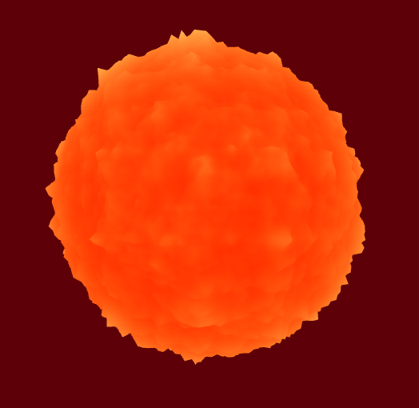

# [Project 1: Noise](https://github.com/CIS-566-Fall-2022/hw01-fireball-base)

  

(Preview)

## Objective

Get comfortable with using WebGL and its shaders to generate an interesting 3D, continuous surface using a multi-octave noise algorithm.

## Result

Gave the sphere a "breathing" movement with summation of multiple sin function, along with a FBM to add texture on top of that. Color of the fireball changes as it expand and shrink. In GUI, there are controls for FBM noise octaves, in addition to tint and brightness for color of the fireball.

## Live Demo
[Breathing Fireball](https://negiowo.github.io/hw00-intro-base/). 
